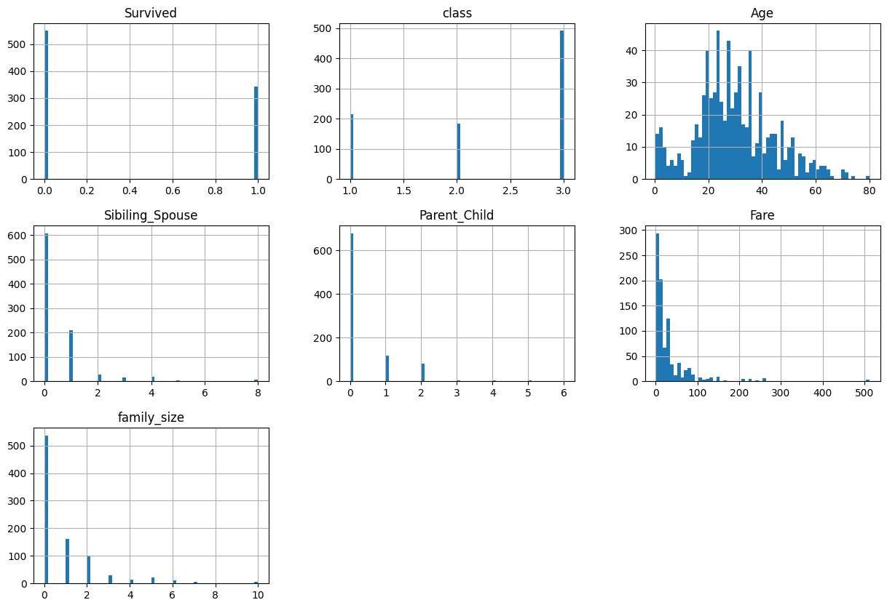
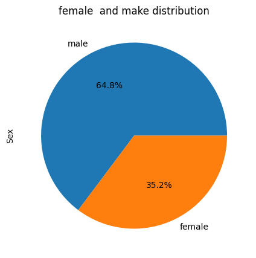
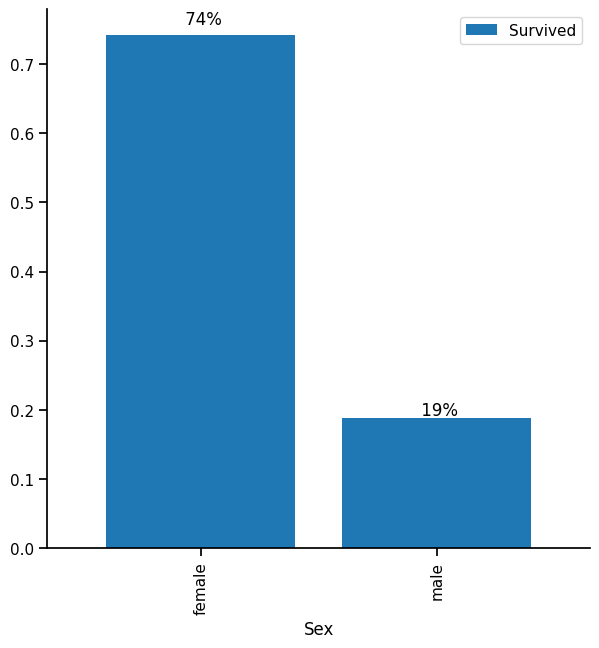

## <mark><span style = "color:red">***Titanic : Survival prediction*** </span> </mark>
#### _This project aims to predict the survival of passengers aboard the Titanic using machine learning. The dataset used in this project contains information about Titanic passengers, such as their age, gender, passenger class, and other relevant features._ 
#### _The <a href= " https://www.kaggle.com/c/titanic/data">dataset </a> is available on Kaggle  and can be downloaded._


## <mark>1.Importing Liberary</mark>


```python
import pandas as pd 
import numpy  as np 
import matplotlib.pyplot as plt
import seaborn as sb
pd.set_option('display.max_columns', None) # To display all columns in the dataframe
```

## <mark>2.Reading data </mark>


```python
df_train = pd.read_csv("Dataset/train.csv")
df_test = pd.read_csv("Dataset/test.csv") 
```


```python
df_test
```


<div>
<style scoped>
    .dataframe tbody tr th:only-of-type {
        vertical-align: middle;
    }

    .dataframe tbody tr th {
        vertical-align: top;
    }

    .dataframe thead th {
        text-align: right;
    }
</style>
<table border="1" class="dataframe">
  <thead>
    <tr style="text-align: right;">
      <th></th>
      <th>PassengerId</th>
      <th>Pclass</th>
      <th>Name</th>
      <th>Sex</th>
      <th>Age</th>
      <th>SibSp</th>
      <th>Parch</th>
      <th>Ticket</th>
      <th>Fare</th>
      <th>Cabin</th>
      <th>Embarked</th>
    </tr>
  </thead>
  <tbody>
    <tr>
      <th>0</th>
      <td>892</td>
      <td>3</td>
      <td>Kelly, Mr. James</td>
      <td>male</td>
      <td>34.5</td>
      <td>0</td>
      <td>0</td>
      <td>330911</td>
      <td>7.8292</td>
      <td>NaN</td>
      <td>Q</td>
    </tr>
    <tr>
      <th>1</th>
      <td>893</td>
      <td>3</td>
      <td>Wilkes, Mrs. James (Ellen Needs)</td>
      <td>female</td>
      <td>47.0</td>
      <td>1</td>
      <td>0</td>
      <td>363272</td>
      <td>7.0000</td>
      <td>NaN</td>
      <td>S</td>
    </tr>
    <tr>
      <th>2</th>
      <td>894</td>
      <td>2</td>
      <td>Myles, Mr. Thomas Francis</td>
      <td>male</td>
      <td>62.0</td>
      <td>0</td>
      <td>0</td>
      <td>240276</td>
      <td>9.6875</td>
      <td>NaN</td>
      <td>Q</td>
    </tr>
    <tr>
      <th>3</th>
      <td>895</td>
      <td>3</td>
      <td>Wirz, Mr. Albert</td>
      <td>male</td>
      <td>27.0</td>
      <td>0</td>
      <td>0</td>
      <td>315154</td>
      <td>8.6625</td>
      <td>NaN</td>
      <td>S</td>
    </tr>
    <tr>
      <th>4</th>
      <td>896</td>
      <td>3</td>
      <td>Hirvonen, Mrs. Alexander (Helga E Lindqvist)</td>
      <td>female</td>
      <td>22.0</td>
      <td>1</td>
      <td>1</td>
      <td>3101298</td>
      <td>12.2875</td>
      <td>NaN</td>
      <td>S</td>
    </tr>
    <tr>
      <th>...</th>
      <td>...</td>
      <td>...</td>
      <td>...</td>
      <td>...</td>
      <td>...</td>
      <td>...</td>
      <td>...</td>
      <td>...</td>
      <td>...</td>
      <td>...</td>
      <td>...</td>
    </tr>
    <tr>
      <th>413</th>
      <td>1305</td>
      <td>3</td>
      <td>Spector, Mr. Woolf</td>
      <td>male</td>
      <td>NaN</td>
      <td>0</td>
      <td>0</td>
      <td>A.5. 3236</td>
      <td>8.0500</td>
      <td>NaN</td>
      <td>S</td>
    </tr>
    <tr>
      <th>414</th>
      <td>1306</td>
      <td>1</td>
      <td>Oliva y Ocana, Dona. Fermina</td>
      <td>female</td>
      <td>39.0</td>
      <td>0</td>
      <td>0</td>
      <td>PC 17758</td>
      <td>108.9000</td>
      <td>C105</td>
      <td>C</td>
    </tr>
    <tr>
      <th>415</th>
      <td>1307</td>
      <td>3</td>
      <td>Saether, Mr. Simon Sivertsen</td>
      <td>male</td>
      <td>38.5</td>
      <td>0</td>
      <td>0</td>
      <td>SOTON/O.Q. 3101262</td>
      <td>7.2500</td>
      <td>NaN</td>
      <td>S</td>
    </tr>
    <tr>
      <th>416</th>
      <td>1308</td>
      <td>3</td>
      <td>Ware, Mr. Frederick</td>
      <td>male</td>
      <td>NaN</td>
      <td>0</td>
      <td>0</td>
      <td>359309</td>
      <td>8.0500</td>
      <td>NaN</td>
      <td>S</td>
    </tr>
    <tr>
      <th>417</th>
      <td>1309</td>
      <td>3</td>
      <td>Peter, Master. Michael J</td>
      <td>male</td>
      <td>NaN</td>
      <td>1</td>
      <td>1</td>
      <td>2668</td>
      <td>22.3583</td>
      <td>NaN</td>
      <td>C</td>
    </tr>
  </tbody>
</table>
<p>418 rows × 11 columns</p>
</div>


## <mark>3.data Cleaning </mark>

><mark>Filtering Out unnecessary columns</mark> 
>>drop name,Ticket, and Cabin number because it is not useful


```python
df_train['Title'] = df_train['Name'].str.split(',').str[1].str.split('.').str[0].str.strip()
df_train['family_size'] = df_train['SibSp'] + df_train['Parch']
df_test['Title'] = df_test['Name'].str.split(',').str[1].str.split('.').str[0].str.strip()
df_test['family_size'] = df_test['SibSp'] + df_test['Parch']
df_train.drop(columns=['Name' , 'Ticket'] , inplace=True) 
df_test.drop(columns=['Name' , 'Ticket'] , inplace=True)
```

><mark>Rename some columns</mark>


```python
df_train.rename(columns= {'PassengerId' : 'ID' , 'Pclass' : 'class' , 'SibSp': 'Sibiling_Spouse' , 'Parch' : 'Parent_Child' , 'Embarked' : 'Port'} , inplace= True)
df_test.rename(columns= {'PassengerId' : 'ID' , 'Pclass' : 'class' , 'SibSp': 'Sibiling_Spouse' , 'Parch' : 'Parent_Child' , 'Embarked' : 'Port'} , inplace= True) 
```

><mark>make Id is the the index</mark> 


```python
df_train.set_index('ID' , inplace=True)
```


```python
df_test.set_index('ID' , inplace=True)
```

><mark>Missing value Check</mark>


```python
df_train.isna().sum()
```


    Survived             0
    class                0
    Sex                  0
    Age                177
    Sibiling_Spouse      0
    Parent_Child         0
    Fare                 0
    Cabin              687
    Port                 2
    Title                0
    family_size          0
    dtype: int64


```python
df_train[df_train['Port'].isna() ]
```


<div>
<style scoped>
    .dataframe tbody tr th:only-of-type {
        vertical-align: middle;
    }

    .dataframe tbody tr th {
        vertical-align: top;
    }

    .dataframe thead th {
        text-align: right;
    }
</style>
<table border="1" class="dataframe">
  <thead>
    <tr style="text-align: right;">
      <th></th>
      <th>Survived</th>
      <th>class</th>
      <th>Sex</th>
      <th>Age</th>
      <th>Sibiling_Spouse</th>
      <th>Parent_Child</th>
      <th>Fare</th>
      <th>Cabin</th>
      <th>Port</th>
      <th>Title</th>
      <th>family_size</th>
    </tr>
    <tr>
      <th>ID</th>
      <th></th>
      <th></th>
      <th></th>
      <th></th>
      <th></th>
      <th></th>
      <th></th>
      <th></th>
      <th></th>
      <th></th>
      <th></th>
    </tr>
  </thead>
  <tbody>
    <tr>
      <th>62</th>
      <td>1</td>
      <td>1</td>
      <td>female</td>
      <td>38.0</td>
      <td>0</td>
      <td>0</td>
      <td>80.0</td>
      <td>B28</td>
      <td>NaN</td>
      <td>Miss</td>
      <td>0</td>
    </tr>
    <tr>
      <th>830</th>
      <td>1</td>
      <td>1</td>
      <td>female</td>
      <td>62.0</td>
      <td>0</td>
      <td>0</td>
      <td>80.0</td>
      <td>B28</td>
      <td>NaN</td>
      <td>Mrs</td>
      <td>0</td>
    </tr>
  </tbody>
</table>
</div>


```python
df_train[df_train['Age'].isna() ]
```


<div>
<style scoped>
    .dataframe tbody tr th:only-of-type {
        vertical-align: middle;
    }

    .dataframe tbody tr th {
        vertical-align: top;
    }

    .dataframe thead th {
        text-align: right;
    }
</style>
<table border="1" class="dataframe">
  <thead>
    <tr style="text-align: right;">
      <th></th>
      <th>Survived</th>
      <th>class</th>
      <th>Sex</th>
      <th>Age</th>
      <th>Sibiling_Spouse</th>
      <th>Parent_Child</th>
      <th>Fare</th>
      <th>Cabin</th>
      <th>Port</th>
      <th>Title</th>
      <th>family_size</th>
    </tr>
    <tr>
      <th>ID</th>
      <th></th>
      <th></th>
      <th></th>
      <th></th>
      <th></th>
      <th></th>
      <th></th>
      <th></th>
      <th></th>
      <th></th>
      <th></th>
    </tr>
  </thead>
  <tbody>
    <tr>
      <th>6</th>
      <td>0</td>
      <td>3</td>
      <td>male</td>
      <td>NaN</td>
      <td>0</td>
      <td>0</td>
      <td>8.4583</td>
      <td>NaN</td>
      <td>Q</td>
      <td>Mr</td>
      <td>0</td>
    </tr>
    <tr>
      <th>18</th>
      <td>1</td>
      <td>2</td>
      <td>male</td>
      <td>NaN</td>
      <td>0</td>
      <td>0</td>
      <td>13.0000</td>
      <td>NaN</td>
      <td>S</td>
      <td>Mr</td>
      <td>0</td>
    </tr>
    <tr>
      <th>20</th>
      <td>1</td>
      <td>3</td>
      <td>female</td>
      <td>NaN</td>
      <td>0</td>
      <td>0</td>
      <td>7.2250</td>
      <td>NaN</td>
      <td>C</td>
      <td>Mrs</td>
      <td>0</td>
    </tr>
    <tr>
      <th>27</th>
      <td>0</td>
      <td>3</td>
      <td>male</td>
      <td>NaN</td>
      <td>0</td>
      <td>0</td>
      <td>7.2250</td>
      <td>NaN</td>
      <td>C</td>
      <td>Mr</td>
      <td>0</td>
    </tr>
    <tr>
      <th>29</th>
      <td>1</td>
      <td>3</td>
      <td>female</td>
      <td>NaN</td>
      <td>0</td>
      <td>0</td>
      <td>7.8792</td>
      <td>NaN</td>
      <td>Q</td>
      <td>Miss</td>
      <td>0</td>
    </tr>
    <tr>
      <th>...</th>
      <td>...</td>
      <td>...</td>
      <td>...</td>
      <td>...</td>
      <td>...</td>
      <td>...</td>
      <td>...</td>
      <td>...</td>
      <td>...</td>
      <td>...</td>
      <td>...</td>
    </tr>
    <tr>
      <th>860</th>
      <td>0</td>
      <td>3</td>
      <td>male</td>
      <td>NaN</td>
      <td>0</td>
      <td>0</td>
      <td>7.2292</td>
      <td>NaN</td>
      <td>C</td>
      <td>Mr</td>
      <td>0</td>
    </tr>
    <tr>
      <th>864</th>
      <td>0</td>
      <td>3</td>
      <td>female</td>
      <td>NaN</td>
      <td>8</td>
      <td>2</td>
      <td>69.5500</td>
      <td>NaN</td>
      <td>S</td>
      <td>Miss</td>
      <td>10</td>
    </tr>
    <tr>
      <th>869</th>
      <td>0</td>
      <td>3</td>
      <td>male</td>
      <td>NaN</td>
      <td>0</td>
      <td>0</td>
      <td>9.5000</td>
      <td>NaN</td>
      <td>S</td>
      <td>Mr</td>
      <td>0</td>
    </tr>
    <tr>
      <th>879</th>
      <td>0</td>
      <td>3</td>
      <td>male</td>
      <td>NaN</td>
      <td>0</td>
      <td>0</td>
      <td>7.8958</td>
      <td>NaN</td>
      <td>S</td>
      <td>Mr</td>
      <td>0</td>
    </tr>
    <tr>
      <th>889</th>
      <td>0</td>
      <td>3</td>
      <td>female</td>
      <td>NaN</td>
      <td>1</td>
      <td>2</td>
      <td>23.4500</td>
      <td>NaN</td>
      <td>S</td>
      <td>Miss</td>
      <td>3</td>
    </tr>
  </tbody>
</table>
<p>177 rows × 11 columns</p>
</div>


```python
df_train[df_train['Age'].isna() & df_train['Port'].isna()  ]
```


<div>
<style scoped>
    .dataframe tbody tr th:only-of-type {
        vertical-align: middle;
    }

    .dataframe tbody tr th {
        vertical-align: top;
    }

    .dataframe thead th {
        text-align: right;
    }
</style>
<table border="1" class="dataframe">
  <thead>
    <tr style="text-align: right;">
      <th></th>
      <th>Survived</th>
      <th>class</th>
      <th>Sex</th>
      <th>Age</th>
      <th>Sibiling_Spouse</th>
      <th>Parent_Child</th>
      <th>Fare</th>
      <th>Cabin</th>
      <th>Port</th>
      <th>Title</th>
      <th>family_size</th>
    </tr>
    <tr>
      <th>ID</th>
      <th></th>
      <th></th>
      <th></th>
      <th></th>
      <th></th>
      <th></th>
      <th></th>
      <th></th>
      <th></th>
      <th></th>
      <th></th>
    </tr>
  </thead>
  <tbody>
  </tbody>
</table>
</div>


>no intersection between missing value of 'Age'  and 'Port' so total rows that has 'Nan' is 179 row


```python
df_train.isna().sum().plot(kind='bar')
plt.title('distribution of missing values in train dataset')
plt.grid()
plt.show()
```


    

    


```python
df_train.describe()
```


<div>
<style scoped>
    .dataframe tbody tr th:only-of-type {
        vertical-align: middle;
    }

    .dataframe tbody tr th {
        vertical-align: top;
    }

    .dataframe thead th {
        text-align: right;
    }
</style>
<table border="1" class="dataframe">
  <thead>
    <tr style="text-align: right;">
      <th></th>
      <th>Survived</th>
      <th>class</th>
      <th>Age</th>
      <th>Sibiling_Spouse</th>
      <th>Parent_Child</th>
      <th>Fare</th>
      <th>family_size</th>
    </tr>
  </thead>
  <tbody>
    <tr>
      <th>count</th>
      <td>891.000000</td>
      <td>891.000000</td>
      <td>714.000000</td>
      <td>891.000000</td>
      <td>891.000000</td>
      <td>891.000000</td>
      <td>891.000000</td>
    </tr>
    <tr>
      <th>mean</th>
      <td>0.383838</td>
      <td>2.308642</td>
      <td>29.699118</td>
      <td>0.523008</td>
      <td>0.381594</td>
      <td>32.204208</td>
      <td>0.904602</td>
    </tr>
    <tr>
      <th>std</th>
      <td>0.486592</td>
      <td>0.836071</td>
      <td>14.526497</td>
      <td>1.102743</td>
      <td>0.806057</td>
      <td>49.693429</td>
      <td>1.613459</td>
    </tr>
    <tr>
      <th>min</th>
      <td>0.000000</td>
      <td>1.000000</td>
      <td>0.420000</td>
      <td>0.000000</td>
      <td>0.000000</td>
      <td>0.000000</td>
      <td>0.000000</td>
    </tr>
    <tr>
      <th>25%</th>
      <td>0.000000</td>
      <td>2.000000</td>
      <td>20.125000</td>
      <td>0.000000</td>
      <td>0.000000</td>
      <td>7.910400</td>
      <td>0.000000</td>
    </tr>
    <tr>
      <th>50%</th>
      <td>0.000000</td>
      <td>3.000000</td>
      <td>28.000000</td>
      <td>0.000000</td>
      <td>0.000000</td>
      <td>14.454200</td>
      <td>0.000000</td>
    </tr>
    <tr>
      <th>75%</th>
      <td>1.000000</td>
      <td>3.000000</td>
      <td>38.000000</td>
      <td>1.000000</td>
      <td>0.000000</td>
      <td>31.000000</td>
      <td>1.000000</td>
    </tr>
    <tr>
      <th>max</th>
      <td>1.000000</td>
      <td>3.000000</td>
      <td>80.000000</td>
      <td>8.000000</td>
      <td>6.000000</td>
      <td>512.329200</td>
      <td>10.000000</td>
    </tr>
  </tbody>
</table>
</div>


```python
PortHistGraph= df_train['Port'].value_counts().plot(kind='bar')
plt.title('Ports distribution')
plt.grid()
PortHistGraph.set_xticklabels(['Southampton', 'Cherbourg', 'Queenstown'], rotation = 0)
```


    [Text(0, 0, 'Southampton'), Text(1, 0, 'Cherbourg'), Text(2, 0, 'Queenstown')]


    

    


>most of the passenger get on board from southampton

>drawing histograms for other numeric columns


```python
df_train.hist(bins = 60 , figsize=(15,10)) 
```


    array([[<Axes: title={'center': 'Survived'}>,
            <Axes: title={'center': 'class'}>,
            <Axes: title={'center': 'Age'}>],
           [<Axes: title={'center': 'Sibiling_Spouse'}>,
            <Axes: title={'center': 'Parent_Child'}>,
            <Axes: title={'center': 'Fare'}>],
           [<Axes: title={'center': 'family_size'}>, <Axes: >, <Axes: >]],
          dtype=object)


    

    


>Replacing the missing value in 'Age' and 'Port' columns according the<a href= "https://vitalflux.com/pandas-impute-missing-values-mean-median-mode/"> distribution of data  </a>


```python
sb.boxplot(x='Age' , data=df_train)
plt.title('Age box plot distribution')

```


    Text(0.5, 1.0, 'Age box plot distribution')


    

    


>Since, there exit lots of outliers, replacing missing values with the mean is not the best thing because outlier effects the mean , we wil use median instead


```python
df_train['Age'].fillna(df_train['Age'].median() , inplace=True)
df_test['Age'].fillna(df_train['Age'].median() , inplace=True)
```


```python
df_train['Port'].fillna('S' , inplace=True)
df_test['Port'].fillna('S' , inplace=True)
```


```python
df_train.isna().sum()
```


    Survived             0
    class                0
    Sex                  0
    Age                  0
    Sibiling_Spouse      0
    Parent_Child         0
    Fare                 0
    Cabin              687
    Port                 0
    Title                0
    family_size          0
    dtype: int64


## <mark>4.data Exploring </mark>

>Exploring the relation between survivals and every coloumn in the graph

><mark>1.Survival Vs class </mark>


```python
df_Class_Vs_Survived = df_train.groupby('class')['Survived'].value_counts(normalize=True).to_frame()
df_Class_Vs_Survived
```


<div>
<style scoped>
    .dataframe tbody tr th:only-of-type {
        vertical-align: middle;
    }

    .dataframe tbody tr th {
        vertical-align: top;
    }

    .dataframe thead th {
        text-align: right;
    }
</style>
<table border="1" class="dataframe">
  <thead>
    <tr style="text-align: right;">
      <th></th>
      <th></th>
      <th>Survived</th>
    </tr>
    <tr>
      <th>class</th>
      <th>Survived</th>
      <th></th>
    </tr>
  </thead>
  <tbody>
    <tr>
      <th rowspan="2" valign="top">1</th>
      <th>1</th>
      <td>0.629630</td>
    </tr>
    <tr>
      <th>0</th>
      <td>0.370370</td>
    </tr>
    <tr>
      <th rowspan="2" valign="top">2</th>
      <th>0</th>
      <td>0.527174</td>
    </tr>
    <tr>
      <th>1</th>
      <td>0.472826</td>
    </tr>
    <tr>
      <th rowspan="2" valign="top">3</th>
      <th>0</th>
      <td>0.757637</td>
    </tr>
    <tr>
      <th>1</th>
      <td>0.242363</td>
    </tr>
  </tbody>
</table>
</div>


```python
df_Class_Vs_Survived.rename(columns = {'Survived' : 'Survived_Rate'}, inplace = True)
df_Class_Vs_Survived.reset_index(level=None, drop=False, inplace=True, col_level=0)
df_Class_Vs_Survived

```


<div>
<style scoped>
    .dataframe tbody tr th:only-of-type {
        vertical-align: middle;
    }

    .dataframe tbody tr th {
        vertical-align: top;
    }

    .dataframe thead th {
        text-align: right;
    }
</style>
<table border="1" class="dataframe">
  <thead>
    <tr style="text-align: right;">
      <th></th>
      <th>class</th>
      <th>Survived</th>
      <th>Survived_Rate</th>
    </tr>
  </thead>
  <tbody>
    <tr>
      <th>0</th>
      <td>1</td>
      <td>1</td>
      <td>0.629630</td>
    </tr>
    <tr>
      <th>1</th>
      <td>1</td>
      <td>0</td>
      <td>0.370370</td>
    </tr>
    <tr>
      <th>2</th>
      <td>2</td>
      <td>0</td>
      <td>0.527174</td>
    </tr>
    <tr>
      <th>3</th>
      <td>2</td>
      <td>1</td>
      <td>0.472826</td>
    </tr>
    <tr>
      <th>4</th>
      <td>3</td>
      <td>0</td>
      <td>0.757637</td>
    </tr>
    <tr>
      <th>5</th>
      <td>3</td>
      <td>1</td>
      <td>0.242363</td>
    </tr>
  </tbody>
</table>
</div>


```python
#df_Class_Vs_Survived['class']
df_notSurvived = df_Class_Vs_Survived[df_Class_Vs_Survived["Survived"] == 0]
df_notSurvived
#df_Class_Vs_Survived['NotSurvived'] = 
```


<div>
<style scoped>
    .dataframe tbody tr th:only-of-type {
        vertical-align: middle;
    }

    .dataframe tbody tr th {
        vertical-align: top;
    }

    .dataframe thead th {
        text-align: right;
    }
</style>
<table border="1" class="dataframe">
  <thead>
    <tr style="text-align: right;">
      <th></th>
      <th>class</th>
      <th>Survived</th>
      <th>Survived_Rate</th>
    </tr>
  </thead>
  <tbody>
    <tr>
      <th>1</th>
      <td>1</td>
      <td>0</td>
      <td>0.370370</td>
    </tr>
    <tr>
      <th>2</th>
      <td>2</td>
      <td>0</td>
      <td>0.527174</td>
    </tr>
    <tr>
      <th>4</th>
      <td>3</td>
      <td>0</td>
      <td>0.757637</td>
    </tr>
  </tbody>
</table>
</div>


```python
df_notSurvived.drop(["Survived"], axis=1,inplace = True)
df_Class_Vs_Survived.drop([1,2,4] , axis=0,inplace = True )
```

    c:\Users\Mohamed Heggi\AppData\Local\Programs\Python\Python39\lib\site-packages\pandas\core\frame.py:4308: SettingWithCopyWarning: 
    A value is trying to be set on a copy of a slice from a DataFrame
    
    See the caveats in the documentation: https://pandas.pydata.org/pandas-docs/stable/user_guide/indexing.html#returning-a-view-versus-a-copy
      return super().drop(
    


```python
df_Class_Vs_Survived.drop(["Survived"], axis=1,inplace = True)
```


```python
df_notSurvived.rename(columns = {'Survived_Rate' : 'NotSurvived_Rate'}, inplace = True)
```


```python
result = pd.merge(df_notSurvived, df_Class_Vs_Survived, on = 'class')
result.set_index('class', inplace = True)
```


```python
colors_list = ['#d9534f','#5bc0de',]
ax = result.plot(kind='bar',figsize=(15,5),width = 0.8,color = colors_list,edgecolor=None)
plt.legend(labels=result.columns,fontsize= 14)
plt.title("Percentage of survival based on class",fontsize= 16)
ax.spines['right'].set_visible(False)
ax.spines['top'].set_visible(False)
ax.spines['left'].set_visible(True)
ax.spines['bottom'].set_visible(True)
for p in ax.patches:
    width = p.get_width()
    height = p.get_height()
    x, y = p.get_xy() 
    ax.annotate(f'{height:.0%}', (x + width/2, y + height*1.02), ha='center')


```


    

    


```python
# another way of plotting the above graph using seaborn
g= sb.barplot(data = df_train.groupby('class')['Survived'].value_counts(normalize=True).to_frame().rename(columns= {"Survived":"Survived_Rate" }).reset_index() , x= "class" , y= "Survived_Rate" ,hue = "Survived" , palette=colors_list  )
sb.despine(fig=None, ax=None, top=True, right=True, left=False, bottom=False, offset=None, trim=False)
for p in g.patches:
    width = p.get_width()
    height = p.get_height()
    x, y = p.get_xy() 
    g.annotate(f'{height:.0%}', (x + width/2, y + height*1.02), ha='center')

```


    

    


<div class="alert alert-block alert-success">
<b>Conclusion 1:</b> from above graphs and table passengers from 1st class are having a highest chance of survival (62.96%) , On the other hand , the lowest chance to survival are to 3rd class (24.23%)
</div>

><mark>2.Survival Vs Sex </mark>


```python
df_train['Sex'].value_counts().plot(kind='pie',autopct='%1.1f%%' , figsize=(5,5))
plt.title('female  and make distribution')
```


    Text(0.5, 1.0, 'female  and make distribution')


    

    


```python
sb.set_context('notebook')
sb.set_palette('tab10')
df_survival_Vs_Sex= df_train.groupby('Sex')['Survived'].mean().to_frame()
df_survival_Vs_Sex

```


<div>
<style scoped>
    .dataframe tbody tr th:only-of-type {
        vertical-align: middle;
    }

    .dataframe tbody tr th {
        vertical-align: top;
    }

    .dataframe thead th {
        text-align: right;
    }
</style>
<table border="1" class="dataframe">
  <thead>
    <tr style="text-align: right;">
      <th></th>
      <th>Survived</th>
    </tr>
    <tr>
      <th>Sex</th>
      <th></th>
    </tr>
  </thead>
  <tbody>
    <tr>
      <th>female</th>
      <td>0.742038</td>
    </tr>
    <tr>
      <th>male</th>
      <td>0.188908</td>
    </tr>
  </tbody>
</table>
</div>


```python
graph = df_survival_Vs_Sex.plot(kind="bar" , figsize= (7,7), width = 0.8)
graph.spines['right'].set_visible(False)
graph.spines['top'].set_visible(False)
graph.spines['left'].set_visible(True)
graph.spines['bottom'].set_visible(True)
for i in graph.patches:
    width = i.get_width()
    height = i.get_height()
    x, y = i.get_xy() 
    graph.annotate(f'{height : .0%}', (x + width/2, y + height*1.02),ha='center')
```


    

    


<div class="alert alert-block alert-success">
<b>Conclusion 2:</b> From the above table Females have higher chance of survival  (74.2038 %).
- Despite the exist of high percentage of male in the data . the percentage of Survived female is more than Survived male 
</div>

><mark>3.Survival Vs Parent_child</mark>


```python
sb.countplot(x=df_train['Parent_Child'], hue=df_train['Survived'])
plt.title('Survival distribution among Parent_Child')
plt.legend(labels=['died', 'Survived'])
```


    <matplotlib.legend.Legend at 0x1c721c2c970>


    

    


```python
total= df_train.groupby('Parent_Child')['Survived'].value_counts(normalize=True).sort_index(ascending=True).to_frame()
total
```


<div>
<style scoped>
    .dataframe tbody tr th:only-of-type {
        vertical-align: middle;
    }

    .dataframe tbody tr th {
        vertical-align: top;
    }

    .dataframe thead th {
        text-align: right;
    }
</style>
<table border="1" class="dataframe">
  <thead>
    <tr style="text-align: right;">
      <th></th>
      <th></th>
      <th>Survived</th>
    </tr>
    <tr>
      <th>Parent_Child</th>
      <th>Survived</th>
      <th></th>
    </tr>
  </thead>
  <tbody>
    <tr>
      <th rowspan="2" valign="top">0</th>
      <th>0</th>
      <td>0.656342</td>
    </tr>
    <tr>
      <th>1</th>
      <td>0.343658</td>
    </tr>
    <tr>
      <th rowspan="2" valign="top">1</th>
      <th>0</th>
      <td>0.449153</td>
    </tr>
    <tr>
      <th>1</th>
      <td>0.550847</td>
    </tr>
    <tr>
      <th rowspan="2" valign="top">2</th>
      <th>0</th>
      <td>0.500000</td>
    </tr>
    <tr>
      <th>1</th>
      <td>0.500000</td>
    </tr>
    <tr>
      <th rowspan="2" valign="top">3</th>
      <th>0</th>
      <td>0.400000</td>
    </tr>
    <tr>
      <th>1</th>
      <td>0.600000</td>
    </tr>
    <tr>
      <th>4</th>
      <th>0</th>
      <td>1.000000</td>
    </tr>
    <tr>
      <th rowspan="2" valign="top">5</th>
      <th>0</th>
      <td>0.800000</td>
    </tr>
    <tr>
      <th>1</th>
      <td>0.200000</td>
    </tr>
    <tr>
      <th>6</th>
      <th>0</th>
      <td>1.000000</td>
    </tr>
  </tbody>
</table>
</div>


```python
# another way of plotting the above graph using seaborn
plt.figure(figsize=(20,5))
g= sb.barplot(data = df_train.groupby('Parent_Child')['Survived'].value_counts(normalize=True).sort_index(ascending=True).to_frame().rename(columns= {"Survived":"Survived_Rate" }).reset_index() , x= "Parent_Child" , y= "Survived_Rate" ,hue = "Survived" , palette=sb.color_palette('dark', 10),width = 0.8)
sb.despine(fig=None, ax=None, top=True, right=True, left=False, bottom=False, offset=None, trim=False)
for p in g.patches:
    width = p.get_width()
    height = p.get_height()
    x, y = p.get_xy() 
    g.annotate(f'{height:.0%}', (x + width/2, y + height*1.02), ha='center')

```


    

    


```python
df_train['Parent_Child'].value_counts().plot(kind = "bar")
```


    <Axes: >


    

    


<div class="alert alert-block alert-success">
<b>Conclusion 3:</b>It seems that there is no exact relation between increasing the number of parents and number of survival because the percentages of if survival increase until it reaches '3' then decrease again
</div>

><mark>4.Survival Vs Sibiling_Spouse</mark>


```python
sb.countplot(x=df_train['Sibiling_Spouse'], hue=df_train['Survived'])
plt.title('Survival distribution among Siibling_Spouse')
plt.legend(labels=['died', 'Survived'])
```


    <matplotlib.legend.Legend at 0x1c721f05b20>


    

    


```python

plt.figure(figsize=(20,5))
g= sb.barplot(data = df_train.groupby('Sibiling_Spouse')['Survived'].value_counts(normalize=True).sort_index(ascending=True).to_frame().rename(columns= {"Survived":"Survived_Rate" }).reset_index() , x= "Sibiling_Spouse" , y= "Survived_Rate" ,hue = "Survived" , palette=sb.color_palette('colorblind', 10),width = 0.8)
sb.despine(fig=None, ax=None, top=True, right=True, left=False, bottom=False, offset=None, trim=False)
for p in g.patches:
    width = p.get_width()
    height = p.get_height()
    x, y = p.get_xy() 
    g.annotate(f'{height:.0%}', (x + width/2, y + height*1.02), ha='center')
```


    

    


```python
df_train['Sibiling_Spouse'].value_counts().plot(kind = "bar")
```


    <Axes: >


    

    


<div class="alert alert-block alert-success">
<b>Conclusion 4:</b>passengers having 5 or 8 spouses/Sibillings have lower chance of survival. Best chance of survival lie between having 1 or 2 percent</div>

><mark>5.Survival Vs Age</mark>


```python
df_train
```


<div>
<style scoped>
    .dataframe tbody tr th:only-of-type {
        vertical-align: middle;
    }

    .dataframe tbody tr th {
        vertical-align: top;
    }

    .dataframe thead th {
        text-align: right;
    }
</style>
<table border="1" class="dataframe">
  <thead>
    <tr style="text-align: right;">
      <th></th>
      <th>Survived</th>
      <th>class</th>
      <th>Sex</th>
      <th>Age</th>
      <th>Sibiling_Spouse</th>
      <th>Parent_Child</th>
      <th>Fare</th>
      <th>Cabin</th>
      <th>Port</th>
      <th>Title</th>
      <th>family_size</th>
    </tr>
    <tr>
      <th>ID</th>
      <th></th>
      <th></th>
      <th></th>
      <th></th>
      <th></th>
      <th></th>
      <th></th>
      <th></th>
      <th></th>
      <th></th>
      <th></th>
    </tr>
  </thead>
  <tbody>
    <tr>
      <th>1</th>
      <td>0</td>
      <td>3</td>
      <td>male</td>
      <td>22.0</td>
      <td>1</td>
      <td>0</td>
      <td>7.2500</td>
      <td>NaN</td>
      <td>S</td>
      <td>Mr</td>
      <td>1</td>
    </tr>
    <tr>
      <th>2</th>
      <td>1</td>
      <td>1</td>
      <td>female</td>
      <td>38.0</td>
      <td>1</td>
      <td>0</td>
      <td>71.2833</td>
      <td>C85</td>
      <td>C</td>
      <td>Mrs</td>
      <td>1</td>
    </tr>
    <tr>
      <th>3</th>
      <td>1</td>
      <td>3</td>
      <td>female</td>
      <td>26.0</td>
      <td>0</td>
      <td>0</td>
      <td>7.9250</td>
      <td>NaN</td>
      <td>S</td>
      <td>Miss</td>
      <td>0</td>
    </tr>
    <tr>
      <th>4</th>
      <td>1</td>
      <td>1</td>
      <td>female</td>
      <td>35.0</td>
      <td>1</td>
      <td>0</td>
      <td>53.1000</td>
      <td>C123</td>
      <td>S</td>
      <td>Mrs</td>
      <td>1</td>
    </tr>
    <tr>
      <th>5</th>
      <td>0</td>
      <td>3</td>
      <td>male</td>
      <td>35.0</td>
      <td>0</td>
      <td>0</td>
      <td>8.0500</td>
      <td>NaN</td>
      <td>S</td>
      <td>Mr</td>
      <td>0</td>
    </tr>
    <tr>
      <th>...</th>
      <td>...</td>
      <td>...</td>
      <td>...</td>
      <td>...</td>
      <td>...</td>
      <td>...</td>
      <td>...</td>
      <td>...</td>
      <td>...</td>
      <td>...</td>
      <td>...</td>
    </tr>
    <tr>
      <th>887</th>
      <td>0</td>
      <td>2</td>
      <td>male</td>
      <td>27.0</td>
      <td>0</td>
      <td>0</td>
      <td>13.0000</td>
      <td>NaN</td>
      <td>S</td>
      <td>Rev</td>
      <td>0</td>
    </tr>
    <tr>
      <th>888</th>
      <td>1</td>
      <td>1</td>
      <td>female</td>
      <td>19.0</td>
      <td>0</td>
      <td>0</td>
      <td>30.0000</td>
      <td>B42</td>
      <td>S</td>
      <td>Miss</td>
      <td>0</td>
    </tr>
    <tr>
      <th>889</th>
      <td>0</td>
      <td>3</td>
      <td>female</td>
      <td>28.0</td>
      <td>1</td>
      <td>2</td>
      <td>23.4500</td>
      <td>NaN</td>
      <td>S</td>
      <td>Miss</td>
      <td>3</td>
    </tr>
    <tr>
      <th>890</th>
      <td>1</td>
      <td>1</td>
      <td>male</td>
      <td>26.0</td>
      <td>0</td>
      <td>0</td>
      <td>30.0000</td>
      <td>C148</td>
      <td>C</td>
      <td>Mr</td>
      <td>0</td>
    </tr>
    <tr>
      <th>891</th>
      <td>0</td>
      <td>3</td>
      <td>male</td>
      <td>32.0</td>
      <td>0</td>
      <td>0</td>
      <td>7.7500</td>
      <td>NaN</td>
      <td>Q</td>
      <td>Mr</td>
      <td>0</td>
    </tr>
  </tbody>
</table>
<p>891 rows × 11 columns</p>
</div>


```python
#g = sb.histplot(data = df_train[df_train['Survived'] == 1], x= 'Age')
plt.figure(figsize=(13,10))

plt.hist(df_train[df_train['Survived'] == 0]['Age'],bins=20, alpha=0.8, label="Died" , edgecolor = "black", color = 'red')
plt.hist(df_train[df_train['Survived'] == 1]['Age'],bins=20, alpha=0.8, label="Survivals" ,edgecolor = "black", color = 'green')
plt.xlabel("Data")
plt.ylabel("Count")

plt.title("Survival / died Historgrams")
plt.legend(loc='upper right')
```


    <matplotlib.legend.Legend at 0x1c7227b5a30>


    

    


<div class="alert alert-block alert-success">
<b>Conclusion 5:</b> it seems like Survivals increase around the median age which is "28-29". Childrens and old people could not survive. As a result , as we go far way from the median the change of survival decrease alot </div>

><mark>6.Survival Vs Fare</mark>


```python
df_train["Fare"].describe()

```


    count    891.000000
    mean      32.204208
    std       49.693429
    min        0.000000
    25%        7.910400
    50%       14.454200
    75%       31.000000
    max      512.329200
    Name: Fare, dtype: float64


```python
df_train["fare_group"] = pd.cut(df_train["Fare"], [-1, 20, 40, 60, 100 , 530], labels=["cheap", "decent price", "midprice",  "Expensive" , "Very Expensive"])
df_test["fare_group"] = pd.cut(df_test["Fare"], [-1, 20, 40, 60, 100 , 530], labels=["cheap", "decent price", "midprice",  "Expensive" , "Very Expensive"])

plt.figure(figsize = (14 ,10 ))
sb.countplot(x=df_train['fare_group'], hue=df_train['Survived'])
plt.title('Survival distribution with Fare')
plt.legend(labels=['died', 'Survived'])
```


    <matplotlib.legend.Legend at 0x1c723c07880>


    

    


<div class="alert alert-block alert-success">
<b>Conclusion 6:</b> from above table and bar graph. it seems that the chance of passenger that has cheap price has more chace of dying than others. Passengers with a decent_price has more change of living</div>

><mark>6.Survival Vs Title</mark>


```python
plt.figure(figsize=(20,5))
graph = df_train.value_counts('Title').plot(kind = "bar")
graph.spines['right'].set_visible(False)
graph.spines['top'].set_visible(False)
for i in graph.patches: 
    width = i.get_width()
    height = i.get_height()
    x, y = i.get_xy() 
    graph.annotate(f'{height/len(df_train) : .3%}', (x + width/2, y + height*1.02),ha='center')
```


    

    


```python
plt.figure(figsize=(20,5))
g= sb.barplot(data = df_train.groupby('Title')['Survived'].value_counts(normalize=True).to_frame().rename(columns= {"Survived":"Survived_Rate" }).reset_index() , x= "Title" , y= "Survived_Rate" ,hue = "Survived" , palette=sb.color_palette('colorblind', 10),width = 0.8)
sb.despine(fig=None, ax=None, top=True, right=True, left=False, bottom=False, offset=None, trim=False)
for p in g.patches:
    width = p.get_width()
    height = p.get_height()
    x, y = p.get_xy() 
    g.annotate(f'{height:.0%}', (x + width/2, y + height*1.02), ha='center')
```


    

    


Conlusion: 
- The captain goes down with the ship because sea captain holds ultimate responsibility for both his ship and everyone embarked on it, and that in an emergency, he will either save them or die trying.
- from the title analysis,   ladyies, Miss, Mrs and Ms have very high chance of survival than any other titles 


><mark>6.Survival Vs Cabin</mark>


most of the cabins consist of a single letter at the beginning followed by a 2 or three digit number. It seems logical that the letter would represent the deck or section of boat where the cabin was located followed by the room number. It would seem that if you knew the section of the boat where someone was staying it would give you insight into their chances of survival. 


```python

df_cabin = df_train[df_train['Cabin'].isnull() == False]['Cabin'].to_frame()
df_cabin['Deck'] = df_cabin['Cabin'].str[0] 
df_cabin['room']= df_cabin['Cabin'].str.slice(1,5).str.extract("([0-9]+)" , expand = False).astype("float")
df_cabin['Survived'] = df_train['Survived']
df_cabin
```


<div>
<style scoped>
    .dataframe tbody tr th:only-of-type {
        vertical-align: middle;
    }

    .dataframe tbody tr th {
        vertical-align: top;
    }

    .dataframe thead th {
        text-align: right;
    }
</style>
<table border="1" class="dataframe">
  <thead>
    <tr style="text-align: right;">
      <th></th>
      <th>Cabin</th>
      <th>Deck</th>
      <th>room</th>
      <th>Survived</th>
    </tr>
    <tr>
      <th>ID</th>
      <th></th>
      <th></th>
      <th></th>
      <th></th>
    </tr>
  </thead>
  <tbody>
    <tr>
      <th>2</th>
      <td>C85</td>
      <td>C</td>
      <td>85.0</td>
      <td>1</td>
    </tr>
    <tr>
      <th>4</th>
      <td>C123</td>
      <td>C</td>
      <td>123.0</td>
      <td>1</td>
    </tr>
    <tr>
      <th>7</th>
      <td>E46</td>
      <td>E</td>
      <td>46.0</td>
      <td>0</td>
    </tr>
    <tr>
      <th>11</th>
      <td>G6</td>
      <td>G</td>
      <td>6.0</td>
      <td>1</td>
    </tr>
    <tr>
      <th>12</th>
      <td>C103</td>
      <td>C</td>
      <td>103.0</td>
      <td>1</td>
    </tr>
    <tr>
      <th>...</th>
      <td>...</td>
      <td>...</td>
      <td>...</td>
      <td>...</td>
    </tr>
    <tr>
      <th>872</th>
      <td>D35</td>
      <td>D</td>
      <td>35.0</td>
      <td>1</td>
    </tr>
    <tr>
      <th>873</th>
      <td>B51 B53 B55</td>
      <td>B</td>
      <td>51.0</td>
      <td>0</td>
    </tr>
    <tr>
      <th>880</th>
      <td>C50</td>
      <td>C</td>
      <td>50.0</td>
      <td>1</td>
    </tr>
    <tr>
      <th>888</th>
      <td>B42</td>
      <td>B</td>
      <td>42.0</td>
      <td>1</td>
    </tr>
    <tr>
      <th>890</th>
      <td>C148</td>
      <td>C</td>
      <td>148.0</td>
      <td>1</td>
    </tr>
  </tbody>
</table>
<p>204 rows × 4 columns</p>
</div>


```python
df_cabin.groupby('Deck')['Survived'].value_counts().sort_index(ascending=True).to_frame().rename(columns= {"Survived":"Survived_Rate" }).reset_index()
```


<div>
<style scoped>
    .dataframe tbody tr th:only-of-type {
        vertical-align: middle;
    }

    .dataframe tbody tr th {
        vertical-align: top;
    }

    .dataframe thead th {
        text-align: right;
    }
</style>
<table border="1" class="dataframe">
  <thead>
    <tr style="text-align: right;">
      <th></th>
      <th>Deck</th>
      <th>Survived</th>
      <th>Survived_Rate</th>
    </tr>
  </thead>
  <tbody>
    <tr>
      <th>0</th>
      <td>A</td>
      <td>0</td>
      <td>8</td>
    </tr>
    <tr>
      <th>1</th>
      <td>A</td>
      <td>1</td>
      <td>7</td>
    </tr>
    <tr>
      <th>2</th>
      <td>B</td>
      <td>0</td>
      <td>12</td>
    </tr>
    <tr>
      <th>3</th>
      <td>B</td>
      <td>1</td>
      <td>35</td>
    </tr>
    <tr>
      <th>4</th>
      <td>C</td>
      <td>0</td>
      <td>24</td>
    </tr>
    <tr>
      <th>5</th>
      <td>C</td>
      <td>1</td>
      <td>35</td>
    </tr>
    <tr>
      <th>6</th>
      <td>D</td>
      <td>0</td>
      <td>8</td>
    </tr>
    <tr>
      <th>7</th>
      <td>D</td>
      <td>1</td>
      <td>25</td>
    </tr>
    <tr>
      <th>8</th>
      <td>E</td>
      <td>0</td>
      <td>8</td>
    </tr>
    <tr>
      <th>9</th>
      <td>E</td>
      <td>1</td>
      <td>24</td>
    </tr>
    <tr>
      <th>10</th>
      <td>F</td>
      <td>0</td>
      <td>5</td>
    </tr>
    <tr>
      <th>11</th>
      <td>F</td>
      <td>1</td>
      <td>8</td>
    </tr>
    <tr>
      <th>12</th>
      <td>G</td>
      <td>0</td>
      <td>2</td>
    </tr>
    <tr>
      <th>13</th>
      <td>G</td>
      <td>1</td>
      <td>2</td>
    </tr>
    <tr>
      <th>14</th>
      <td>T</td>
      <td>0</td>
      <td>1</td>
    </tr>
  </tbody>
</table>
</div>


```python
plt.figure(figsize=(20,5))
g= sb.barplot(data = df_cabin.groupby('Deck')['Survived'].value_counts(normalize = True).sort_index(ascending=True).to_frame().rename(columns= {"Survived":"Survived_Rate" }).reset_index(), x= "Deck" , y= "Survived_Rate" ,hue = "Survived" , palette=sb.color_palette('colorblind', 10),width = 0.8)
sb.despine(fig=None, ax=None, top=True, right=True, left=False, bottom=False, offset=None, trim=False)
for p in g.patches:
    width = p.get_width()
    height = p.get_height()
    x, y = p.get_xy() 
    g.annotate(f'{height:.0%}', (x + width/2, y + height*1.02), ha='center')
```


    

    


it seems that passengers in the middle decks have more surival chance than others. Thus, we can extract these variables and create a new feature called 'Deck' that represents the deck of the cabin. Moreover, we will convert the feature into a numeric variable. The missing values will be converted to zero.


```python
df_train['Deck'] = df_train['Cabin'].str[0] 
df_test['Deck'] = df_test['Cabin'].str[0] 
```


```python
df_train.drop(['Cabin'] , axis = 1 , inplace = True)
df_test.drop(['Cabin'] , axis = 1 , inplace = True)

```


```python
df_train['Deck'].fillna("N" , inplace = True)
df_test['Deck'].fillna("N" , inplace = True)
```


```python
df_train
```


<div>
<style scoped>
    .dataframe tbody tr th:only-of-type {
        vertical-align: middle;
    }

    .dataframe tbody tr th {
        vertical-align: top;
    }

    .dataframe thead th {
        text-align: right;
    }
</style>
<table border="1" class="dataframe">
  <thead>
    <tr style="text-align: right;">
      <th></th>
      <th>Survived</th>
      <th>class</th>
      <th>Sex</th>
      <th>Age</th>
      <th>Sibiling_Spouse</th>
      <th>Parent_Child</th>
      <th>Fare</th>
      <th>Port</th>
      <th>Title</th>
      <th>family_size</th>
      <th>fare_group</th>
      <th>Deck</th>
    </tr>
    <tr>
      <th>ID</th>
      <th></th>
      <th></th>
      <th></th>
      <th></th>
      <th></th>
      <th></th>
      <th></th>
      <th></th>
      <th></th>
      <th></th>
      <th></th>
      <th></th>
    </tr>
  </thead>
  <tbody>
    <tr>
      <th>1</th>
      <td>0</td>
      <td>3</td>
      <td>male</td>
      <td>22.0</td>
      <td>1</td>
      <td>0</td>
      <td>7.2500</td>
      <td>S</td>
      <td>Mr</td>
      <td>1</td>
      <td>cheap</td>
      <td>N</td>
    </tr>
    <tr>
      <th>2</th>
      <td>1</td>
      <td>1</td>
      <td>female</td>
      <td>38.0</td>
      <td>1</td>
      <td>0</td>
      <td>71.2833</td>
      <td>C</td>
      <td>Mrs</td>
      <td>1</td>
      <td>Expensive</td>
      <td>C</td>
    </tr>
    <tr>
      <th>3</th>
      <td>1</td>
      <td>3</td>
      <td>female</td>
      <td>26.0</td>
      <td>0</td>
      <td>0</td>
      <td>7.9250</td>
      <td>S</td>
      <td>Miss</td>
      <td>0</td>
      <td>cheap</td>
      <td>N</td>
    </tr>
    <tr>
      <th>4</th>
      <td>1</td>
      <td>1</td>
      <td>female</td>
      <td>35.0</td>
      <td>1</td>
      <td>0</td>
      <td>53.1000</td>
      <td>S</td>
      <td>Mrs</td>
      <td>1</td>
      <td>midprice</td>
      <td>C</td>
    </tr>
    <tr>
      <th>5</th>
      <td>0</td>
      <td>3</td>
      <td>male</td>
      <td>35.0</td>
      <td>0</td>
      <td>0</td>
      <td>8.0500</td>
      <td>S</td>
      <td>Mr</td>
      <td>0</td>
      <td>cheap</td>
      <td>N</td>
    </tr>
    <tr>
      <th>...</th>
      <td>...</td>
      <td>...</td>
      <td>...</td>
      <td>...</td>
      <td>...</td>
      <td>...</td>
      <td>...</td>
      <td>...</td>
      <td>...</td>
      <td>...</td>
      <td>...</td>
      <td>...</td>
    </tr>
    <tr>
      <th>887</th>
      <td>0</td>
      <td>2</td>
      <td>male</td>
      <td>27.0</td>
      <td>0</td>
      <td>0</td>
      <td>13.0000</td>
      <td>S</td>
      <td>Rev</td>
      <td>0</td>
      <td>cheap</td>
      <td>N</td>
    </tr>
    <tr>
      <th>888</th>
      <td>1</td>
      <td>1</td>
      <td>female</td>
      <td>19.0</td>
      <td>0</td>
      <td>0</td>
      <td>30.0000</td>
      <td>S</td>
      <td>Miss</td>
      <td>0</td>
      <td>decent price</td>
      <td>B</td>
    </tr>
    <tr>
      <th>889</th>
      <td>0</td>
      <td>3</td>
      <td>female</td>
      <td>28.0</td>
      <td>1</td>
      <td>2</td>
      <td>23.4500</td>
      <td>S</td>
      <td>Miss</td>
      <td>3</td>
      <td>decent price</td>
      <td>N</td>
    </tr>
    <tr>
      <th>890</th>
      <td>1</td>
      <td>1</td>
      <td>male</td>
      <td>26.0</td>
      <td>0</td>
      <td>0</td>
      <td>30.0000</td>
      <td>C</td>
      <td>Mr</td>
      <td>0</td>
      <td>decent price</td>
      <td>C</td>
    </tr>
    <tr>
      <th>891</th>
      <td>0</td>
      <td>3</td>
      <td>male</td>
      <td>32.0</td>
      <td>0</td>
      <td>0</td>
      <td>7.7500</td>
      <td>Q</td>
      <td>Mr</td>
      <td>0</td>
      <td>cheap</td>
      <td>N</td>
    </tr>
  </tbody>
</table>
<p>891 rows × 12 columns</p>
</div>


```python

```

><mark>6.Survival Vs (Sex and class)</mark>


```python
df_train.pivot_table(index='class', columns='Sex', values='Survived')
```


<div>
<style scoped>
    .dataframe tbody tr th:only-of-type {
        vertical-align: middle;
    }

    .dataframe tbody tr th {
        vertical-align: top;
    }

    .dataframe thead th {
        text-align: right;
    }
</style>
<table border="1" class="dataframe">
  <thead>
    <tr style="text-align: right;">
      <th>Sex</th>
      <th>female</th>
      <th>male</th>
    </tr>
    <tr>
      <th>class</th>
      <th></th>
      <th></th>
    </tr>
  </thead>
  <tbody>
    <tr>
      <th>1</th>
      <td>0.968085</td>
      <td>0.368852</td>
    </tr>
    <tr>
      <th>2</th>
      <td>0.921053</td>
      <td>0.157407</td>
    </tr>
    <tr>
      <th>3</th>
      <td>0.500000</td>
      <td>0.135447</td>
    </tr>
  </tbody>
</table>
</div>


```python

plt.figure(figsize=(12,8))
sb.heatmap(df_train.pivot_table(index='class', columns='Sex', values='Survived'),  linewidths=1, cmap='RdBu', linecolor='white', annot=True)
plt.title('Survival ratio by passenger class and sex')

```


    Text(0.5, 1.0, 'Survival ratio by passenger class and sex')


    

    


><mark>6.Survival Vs (Sex and family_size)</mark>


```python
df_train.pivot_table(index='family_size', columns='Sex', values='Survived')
```


<div>
<style scoped>
    .dataframe tbody tr th:only-of-type {
        vertical-align: middle;
    }

    .dataframe tbody tr th {
        vertical-align: top;
    }

    .dataframe thead th {
        text-align: right;
    }
</style>
<table border="1" class="dataframe">
  <thead>
    <tr style="text-align: right;">
      <th>Sex</th>
      <th>female</th>
      <th>male</th>
    </tr>
    <tr>
      <th>family_size</th>
      <th></th>
      <th></th>
    </tr>
  </thead>
  <tbody>
    <tr>
      <th>0</th>
      <td>0.785714</td>
      <td>0.155718</td>
    </tr>
    <tr>
      <th>1</th>
      <td>0.816092</td>
      <td>0.243243</td>
    </tr>
    <tr>
      <th>2</th>
      <td>0.775510</td>
      <td>0.396226</td>
    </tr>
    <tr>
      <th>3</th>
      <td>0.842105</td>
      <td>0.500000</td>
    </tr>
    <tr>
      <th>4</th>
      <td>0.250000</td>
      <td>0.000000</td>
    </tr>
    <tr>
      <th>5</th>
      <td>0.375000</td>
      <td>0.000000</td>
    </tr>
    <tr>
      <th>6</th>
      <td>0.375000</td>
      <td>0.250000</td>
    </tr>
    <tr>
      <th>7</th>
      <td>0.000000</td>
      <td>0.000000</td>
    </tr>
    <tr>
      <th>10</th>
      <td>0.000000</td>
      <td>0.000000</td>
    </tr>
  </tbody>
</table>
</div>


```python
plt.figure(figsize=(12,8))
sb.heatmap(df_train.pivot_table(index='family_size', columns='Sex', values='Survived'),  linewidths=1, cmap='RdBu', linecolor='white', annot=True)
plt.title('Survival ratio by passenger class and sex')
```


    Text(0.5, 1.0, 'Survival ratio by passenger class and sex')


    

    


conclusion:
- it seems that every one with family size of 4 or more died
- females with family size less than 4 has higher chance of survival than males

## <mark>4.data Preparing for modelling </mark>


```python
df_train.drop(['Sibiling_Spouse' , 'Parent_Child'] , axis = 1 , inplace = True)
```


```python
df_test.drop(['Sibiling_Spouse' , 'Parent_Child'] , axis = 1 , inplace = True)
```

Sex Mapping


```python
sex_mapping = {"male": 0, "female": 1}
df_train["Sex"]= df_train['Sex'].map(sex_mapping)
```


```python
df_test["Sex"]= df_test['Sex'].map(sex_mapping)
```


Title Map

Mr : 0
Miss : 1
Mrs: 2
Others: 3


```python
title_mapping = {"Mr": 0, "Miss": 1, "Mrs": 2, 
                 "Master": 3, "Dr": 3, "Rev": 3, "Col": 3, "Major": 3, "Mlle": 3,"Countess": 3,
                 "Ms": 3, "Lady": 3, "Jonkheer": 3, "Don": 3, "Dona" : 3, "Mme": 3,"Capt": 3,"Sir": 3 }
df_train["Title"]= df_train['Title'].map(title_mapping)
df_test["Title"]= df_test['Title'].map(title_mapping)

```

mapping of ports using dummy variables


```python
df_train = pd.concat([df_train, pd.get_dummies(df_train['Port'], prefix='Port')], axis=1)
df_test = pd.concat([df_test, pd.get_dummies(df_test['Port'], prefix='Port')], axis=1)

```

mapping of decks using dummy variables


```python
df_train = pd.concat([df_train, pd.get_dummies(df_train['Deck'], prefix='Deck')], axis=1)
df_test = pd.concat([df_test, pd.get_dummies(df_test['Deck'], prefix='Deck')], axis=1)
df_train.drop(['Deck_N'] , axis = 1 , inplace = True)
df_test.drop(['Deck_N'] , axis = 1 , inplace = True)

```


```python
df_train.drop(["fare_group", 'Port', 'Deck'], axis = 1 , inplace = True)
df_test.drop(["fare_group", 'Port' , 'Deck'], axis = 1 , inplace = True)
```


```python
plt.figure(figsize=(14,12))
plt.title('Pearson Correlation of Features')
sb.heatmap(df_train.corr(), linewidths=1,
           square=True, cmap='RdBu', linecolor='white', annot=True)
```


    <Axes: title={'center': 'Pearson Correlation of Features'}>


    

    


## <mark>5.Modeling </mark>


```python
from sklearn.tree import DecisionTreeClassifier,ExtraTreeClassifier
y = df_train.Survived 
df_train.drop(['Survived'], axis=1 , inplace= True) 
X = df_train[list(df_train.columns)]
```


```python
from sklearn.model_selection import train_test_split
train_X, val_X, train_y, val_y = train_test_split(X, y, random_state=1)
model = DecisionTreeClassifier(random_state =1 )

model.fit(train_X ,train_y)

```


<style>#sk-container-id-1 {color: black;}#sk-container-id-1 pre{padding: 0;}#sk-container-id-1 div.sk-toggleable {background-color: white;}#sk-container-id-1 label.sk-toggleable__label {cursor: pointer;display: block;width: 100%;margin-bottom: 0;padding: 0.3em;box-sizing: border-box;text-align: center;}#sk-container-id-1 label.sk-toggleable__label-arrow:before {content: "▸";float: left;margin-right: 0.25em;color: #696969;}#sk-container-id-1 label.sk-toggleable__label-arrow:hover:before {color: black;}#sk-container-id-1 div.sk-estimator:hover label.sk-toggleable__label-arrow:before {color: black;}#sk-container-id-1 div.sk-toggleable__content {max-height: 0;max-width: 0;overflow: hidden;text-align: left;background-color: #f0f8ff;}#sk-container-id-1 div.sk-toggleable__content pre {margin: 0.2em;color: black;border-radius: 0.25em;background-color: #f0f8ff;}#sk-container-id-1 input.sk-toggleable__control:checked~div.sk-toggleable__content {max-height: 200px;max-width: 100%;overflow: auto;}#sk-container-id-1 input.sk-toggleable__control:checked~label.sk-toggleable__label-arrow:before {content: "▾";}#sk-container-id-1 div.sk-estimator input.sk-toggleable__control:checked~label.sk-toggleable__label {background-color: #d4ebff;}#sk-container-id-1 div.sk-label input.sk-toggleable__control:checked~label.sk-toggleable__label {background-color: #d4ebff;}#sk-container-id-1 input.sk-hidden--visually {border: 0;clip: rect(1px 1px 1px 1px);clip: rect(1px, 1px, 1px, 1px);height: 1px;margin: -1px;overflow: hidden;padding: 0;position: absolute;width: 1px;}#sk-container-id-1 div.sk-estimator {font-family: monospace;background-color: #f0f8ff;border: 1px dotted black;border-radius: 0.25em;box-sizing: border-box;margin-bottom: 0.5em;}#sk-container-id-1 div.sk-estimator:hover {background-color: #d4ebff;}#sk-container-id-1 div.sk-parallel-item::after {content: "";width: 100%;border-bottom: 1px solid gray;flex-grow: 1;}#sk-container-id-1 div.sk-label:hover label.sk-toggleable__label {background-color: #d4ebff;}#sk-container-id-1 div.sk-serial::before {content: "";position: absolute;border-left: 1px solid gray;box-sizing: border-box;top: 0;bottom: 0;left: 50%;z-index: 0;}#sk-container-id-1 div.sk-serial {display: flex;flex-direction: column;align-items: center;background-color: white;padding-right: 0.2em;padding-left: 0.2em;position: relative;}#sk-container-id-1 div.sk-item {position: relative;z-index: 1;}#sk-container-id-1 div.sk-parallel {display: flex;align-items: stretch;justify-content: center;background-color: white;position: relative;}#sk-container-id-1 div.sk-item::before, #sk-container-id-1 div.sk-parallel-item::before {content: "";position: absolute;border-left: 1px solid gray;box-sizing: border-box;top: 0;bottom: 0;left: 50%;z-index: -1;}#sk-container-id-1 div.sk-parallel-item {display: flex;flex-direction: column;z-index: 1;position: relative;background-color: white;}#sk-container-id-1 div.sk-parallel-item:first-child::after {align-self: flex-end;width: 50%;}#sk-container-id-1 div.sk-parallel-item:last-child::after {align-self: flex-start;width: 50%;}#sk-container-id-1 div.sk-parallel-item:only-child::after {width: 0;}#sk-container-id-1 div.sk-dashed-wrapped {border: 1px dashed gray;margin: 0 0.4em 0.5em 0.4em;box-sizing: border-box;padding-bottom: 0.4em;background-color: white;}#sk-container-id-1 div.sk-label label {font-family: monospace;font-weight: bold;display: inline-block;line-height: 1.2em;}#sk-container-id-1 div.sk-label-container {text-align: center;}#sk-container-id-1 div.sk-container {/* jupyter's `normalize.less` sets `[hidden] { display: none; }` but bootstrap.min.css set `[hidden] { display: none !important; }` so we also need the `!important` here to be able to override the default hidden behavior on the sphinx rendered scikit-learn.org. See: https://github.com/scikit-learn/scikit-learn/issues/21755 */display: inline-block !important;position: relative;}#sk-container-id-1 div.sk-text-repr-fallback {display: none;}</style><div id="sk-container-id-1" class="sk-top-container"><div class="sk-text-repr-fallback"><pre>DecisionTreeClassifier(random_state=1)</pre><b>In a Jupyter environment, please rerun this cell to show the HTML representation or trust the notebook. <br />On GitHub, the HTML representation is unable to render, please try loading this page with nbviewer.org.</b></div><div class="sk-container" hidden><div class="sk-item"><div class="sk-estimator sk-toggleable"><input class="sk-toggleable__control sk-hidden--visually" id="sk-estimator-id-1" type="checkbox" checked><label for="sk-estimator-id-1" class="sk-toggleable__label sk-toggleable__label-arrow">DecisionTreeClassifier</label><div class="sk-toggleable__content"><pre>DecisionTreeClassifier(random_state=1)</pre></div></div></div></div></div>


```python
val_predictions = model.predict(val_X)
```


```python
import sklearn.metrics as metrics
metrics.accuracy_score(val_y , val_predictions, normalize=True, sample_weight=None)
```


    0.757847533632287


predict from test data


```python
df_test["Deck_T"] = 0
```


```python
df_test
```


<div>
<style scoped>
    .dataframe tbody tr th:only-of-type {
        vertical-align: middle;
    }

    .dataframe tbody tr th {
        vertical-align: top;
    }

    .dataframe thead th {
        text-align: right;
    }
</style>
<table border="1" class="dataframe">
  <thead>
    <tr style="text-align: right;">
      <th></th>
      <th>class</th>
      <th>Sex</th>
      <th>Age</th>
      <th>Fare</th>
      <th>Title</th>
      <th>family_size</th>
      <th>Port_C</th>
      <th>Port_Q</th>
      <th>Port_S</th>
      <th>Deck_A</th>
      <th>Deck_B</th>
      <th>Deck_C</th>
      <th>Deck_D</th>
      <th>Deck_E</th>
      <th>Deck_F</th>
      <th>Deck_G</th>
      <th>Deck_T</th>
    </tr>
    <tr>
      <th>ID</th>
      <th></th>
      <th></th>
      <th></th>
      <th></th>
      <th></th>
      <th></th>
      <th></th>
      <th></th>
      <th></th>
      <th></th>
      <th></th>
      <th></th>
      <th></th>
      <th></th>
      <th></th>
      <th></th>
      <th></th>
    </tr>
  </thead>
  <tbody>
    <tr>
      <th>892</th>
      <td>3</td>
      <td>0</td>
      <td>34.5</td>
      <td>7.8292</td>
      <td>0</td>
      <td>0</td>
      <td>0</td>
      <td>1</td>
      <td>0</td>
      <td>0</td>
      <td>0</td>
      <td>0</td>
      <td>0</td>
      <td>0</td>
      <td>0</td>
      <td>0</td>
      <td>0</td>
    </tr>
    <tr>
      <th>893</th>
      <td>3</td>
      <td>1</td>
      <td>47.0</td>
      <td>7.0000</td>
      <td>2</td>
      <td>1</td>
      <td>0</td>
      <td>0</td>
      <td>1</td>
      <td>0</td>
      <td>0</td>
      <td>0</td>
      <td>0</td>
      <td>0</td>
      <td>0</td>
      <td>0</td>
      <td>0</td>
    </tr>
    <tr>
      <th>894</th>
      <td>2</td>
      <td>0</td>
      <td>62.0</td>
      <td>9.6875</td>
      <td>0</td>
      <td>0</td>
      <td>0</td>
      <td>1</td>
      <td>0</td>
      <td>0</td>
      <td>0</td>
      <td>0</td>
      <td>0</td>
      <td>0</td>
      <td>0</td>
      <td>0</td>
      <td>0</td>
    </tr>
    <tr>
      <th>895</th>
      <td>3</td>
      <td>0</td>
      <td>27.0</td>
      <td>8.6625</td>
      <td>0</td>
      <td>0</td>
      <td>0</td>
      <td>0</td>
      <td>1</td>
      <td>0</td>
      <td>0</td>
      <td>0</td>
      <td>0</td>
      <td>0</td>
      <td>0</td>
      <td>0</td>
      <td>0</td>
    </tr>
    <tr>
      <th>896</th>
      <td>3</td>
      <td>1</td>
      <td>22.0</td>
      <td>12.2875</td>
      <td>2</td>
      <td>2</td>
      <td>0</td>
      <td>0</td>
      <td>1</td>
      <td>0</td>
      <td>0</td>
      <td>0</td>
      <td>0</td>
      <td>0</td>
      <td>0</td>
      <td>0</td>
      <td>0</td>
    </tr>
    <tr>
      <th>...</th>
      <td>...</td>
      <td>...</td>
      <td>...</td>
      <td>...</td>
      <td>...</td>
      <td>...</td>
      <td>...</td>
      <td>...</td>
      <td>...</td>
      <td>...</td>
      <td>...</td>
      <td>...</td>
      <td>...</td>
      <td>...</td>
      <td>...</td>
      <td>...</td>
      <td>...</td>
    </tr>
    <tr>
      <th>1305</th>
      <td>3</td>
      <td>0</td>
      <td>28.0</td>
      <td>8.0500</td>
      <td>0</td>
      <td>0</td>
      <td>0</td>
      <td>0</td>
      <td>1</td>
      <td>0</td>
      <td>0</td>
      <td>0</td>
      <td>0</td>
      <td>0</td>
      <td>0</td>
      <td>0</td>
      <td>0</td>
    </tr>
    <tr>
      <th>1306</th>
      <td>1</td>
      <td>1</td>
      <td>39.0</td>
      <td>108.9000</td>
      <td>3</td>
      <td>0</td>
      <td>1</td>
      <td>0</td>
      <td>0</td>
      <td>0</td>
      <td>0</td>
      <td>1</td>
      <td>0</td>
      <td>0</td>
      <td>0</td>
      <td>0</td>
      <td>0</td>
    </tr>
    <tr>
      <th>1307</th>
      <td>3</td>
      <td>0</td>
      <td>38.5</td>
      <td>7.2500</td>
      <td>0</td>
      <td>0</td>
      <td>0</td>
      <td>0</td>
      <td>1</td>
      <td>0</td>
      <td>0</td>
      <td>0</td>
      <td>0</td>
      <td>0</td>
      <td>0</td>
      <td>0</td>
      <td>0</td>
    </tr>
    <tr>
      <th>1308</th>
      <td>3</td>
      <td>0</td>
      <td>28.0</td>
      <td>8.0500</td>
      <td>0</td>
      <td>0</td>
      <td>0</td>
      <td>0</td>
      <td>1</td>
      <td>0</td>
      <td>0</td>
      <td>0</td>
      <td>0</td>
      <td>0</td>
      <td>0</td>
      <td>0</td>
      <td>0</td>
    </tr>
    <tr>
      <th>1309</th>
      <td>3</td>
      <td>0</td>
      <td>28.0</td>
      <td>22.3583</td>
      <td>3</td>
      <td>2</td>
      <td>1</td>
      <td>0</td>
      <td>0</td>
      <td>0</td>
      <td>0</td>
      <td>0</td>
      <td>0</td>
      <td>0</td>
      <td>0</td>
      <td>0</td>
      <td>0</td>
    </tr>
  </tbody>
</table>
<p>418 rows × 17 columns</p>
</div>


```python
X = df_test[list(df_test.columns)]
submission_predictions = model.predict(X)
df_test['Survived'] = submission_predictions

```


```python
df_test = df_test.reset_index()
df_test.rename(columns = {"ID" : "PassengerId"}, inplace = True)
```


```python
df_test[['PassengerId' , 'Survived']].to_csv('Submission/submission.csv' , index = False)
```

>Conclusion

1-From the heatmap we conclude that women in the 1st class had the highest chance of survival (97%), whereas men in the 3rd class had the lowest chance of survival (14%). Note that women in each class had higher survival ratio. Even women from 3rd class had higher chance of surviving the catastrophe than men from 1st class.

2-it seems that the chance of passenger that has cheap price has more chace of survival than others

3-it seems like Survivals increase around the median age which is "28-29". Childrens and old people could not survive. As a result , as we go far way from the median the change of survival decrease alot.

4-passengers having 5 or 8 spouses/Sibillings have lower chance of survival. Best chance of survival lie between having 1 or 2 percent.

5-It seems that there is no exact relation between increasing the number of parents and number of survival because the percentages of if survival increase until it reaches '3' then decrease again.

6-Despite the exist of high percentage of male in the data . the percentage of Survived female is more than Survived male.Females have higher chance of survival  (74.2038 %).
7-passengers from 1st class are having a highest chance of survival (62.96%) , On the other hand , the lowest chance to survival are to 3rd class (24.23%)


```python

```
